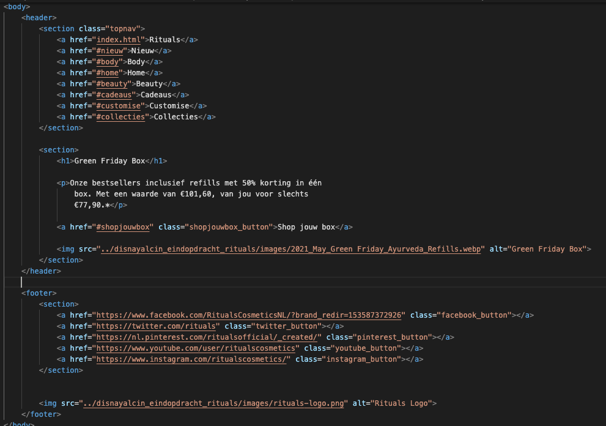

# Procesverslag
Markdown is een simpele manier om HTML te schrijven.  
Markdown cheat cheet: [Hulp bij het schrijven van Markdown](https://github.com/adam-p/markdown-here/wiki/Markdown-Cheatsheet).

Nb. De standaardstructuur en de spartaanse opmaak van de README.md zijn helemaal prima. Het gaat om de inhoud van je procesverslag. Besteedt de tijd voor pracht en praal aan je website.

Nb. Door *open* toe te voegen aan een *details* element kun je deze standaard open zetten. Fijn om dat steeds voor de relevante stuk(ken) te doen.

## Jij

uitwerken voor kick-off werkgroep

### Auteur:
Disna Yalcin

#### Je startniveau:
Blauw

#### Je focus:
Surface plane

#### Gekozen website:
Rituals
 

## Je website

uitwerken voor kick-off werkgroep

### Je opdracht:
Link naar de website die ik ga namaken:
<a href="https://www.rituals.com/nl-nl/home?gclid=CjwKCAiA7dKMBhBCEiwAO_crFOYymkhQO6RGSX035LMTfo6D3btGV6WR75l2s_9AW_4IVeQfyGSxNxoC9rMQAvD_BwE&gclsrc=aw.ds">Rituals</a>

#### Screenshot(s) van de eerste pagina (small screen): 
Douche & Badproducten

#### Screenshot(s) van de tweede pagina (small screen):
Magazine 

 

## Breakdownschets (week 1)

uitwerken na afloop 2e werkgroep

### de hele pagina: 

### dynamisch deel (bijv menu): 

### wellicht nog een dynamisch deel (bijv filter): 

## Voortgang 1 (week 2)

uitwerken voor 1e voortgang

### Stand van zaken
Ik heb door omstandigheden niet echt veel aan de code gedaan. Ik weet wel welke informatie waar moet
komen, maar vind het lastig om dat te doen. Ik heb dus vooral in html gewerkt om een beginnetje gemaakt
te hebben. Ik moet verder dus nog goed naar alles in css kijken. Er staat een klein deel in css verwerkt,
maar dat is echt een heel klein deel.

### Agenda voor meeting
samen met je groepje opstellen

| student 1      | student 2          | student 3    | student 4        |
| ---            | ---                | ---          | ---              |
| dit bespreken  | en dit             | en ik dit    | en dan ik dat    |
| en dat ook nog | dit als er tijd is | nog een punt | dit wil ik zeker |
| ...            | ...                | ...          | ...              |

### Verslag van meeting
hier na afloop snel de uitkomsten van de meeting vastleggen

- punt 1: Ik moet goed kijken naar hoe ik mijn css verder ga uitwerken. Ik was al wel goed opweg, maar dat was nog niet genoeg.
- punt 2: Ik had classes gebruikt en die mogen niet gebruikt worden voor deze opdracht. Bo had mij de tip gegeven om het op een
          andere manier te doen.
- punt 3: In mijn css had ik gebruik gemaakt van px. Deze kon ik nog het beste omzetten in em of %.

## Voortgang 2 (week 3)

uitwerken voor 2e voortgang

### Stand van zaken
De vorige keer heb ik niet erg veel aan de opdracht gewerkt door vormgeving 2. De feedback die ik toen heb gekregen, was om vooral op
dezelfde manier door te gaan in de html. Ik vond het erg lastig om een beginnetje te maken in css en heb Bo (student-assistent) om hulp
gevraagd. Zij heeft mij geholpen in de fysieke les en wij hebben samen naar de code gekeken die ik al had. Doordat Bo mij heeft geholpen
heb ik echt vooruitgang geboekt (met mijn eerste pagina). 

### Agenda voor meeting
samen met je groepje opstellen

| student 1      | student 2          | student 3    | student 4        |
| ---            | ---                | ---          | ---              |
| dit bespreken  | en dit             | en ik dit    | en dan ik dat    |
| en dat ook nog | dit als er tijd is | nog een punt | dit wil ik zeker |
| ...            | ...                | ...          | ...              |

### Verslag van meeting
hier na afloop snel de uitkomsten van de meeting vastleggen

- punt 1: Voor de feedback button heb ik "position sticky" gebruikt, maar wat in dit geval beter is om "position fixed" te doen
          en daarbij de z-index een waarde te geven. 
- punt 2: Ik had de feedback button in een "li" gezet, maar dat klopt niet helemaal. Die kan beter omgezet worden naar een losse section.
- punt 3: De position absolute die overal staat, kan ik het beste weg doen. Hierdoor kunnen bijvoorbeeld h2's en afbeeldingen "ademen".
          Alles staat al zo goed in de html verwerkt dat ik hier niet al te veel meer aan hoef te veranderen.
- punt 4: Dit punt sluit aan op punt 3, omdat de "fixed heights" overal weg kunnen doordat de position absolute weg wordt gehaald.

## Toegankelijkheidstest (week 4)

uitwerken na test in 8e voortgang

### Bevindingen
Lijst met je bevindingen die in de test naar voren kwamen:

#### Titel eerste bevinding
Hier korte omschrijving (met indien nodig een afbeelding)

Hier een omschrijving van hoe het opgelost kan worden (met indien nodig een afbeelding)

#### Titel tweede bevinding. 
Hier korte omschrijving (met indien nodig een afbeelding)

Hier een omschrijving van hoe het opgelost kan worden (met indien nodig een afbeelding)

#### Titel volgende bevinding. 
Hier korte omschrijving (met indien nodig een afbeelding)

Hier een omschrijving van hoe het opgelost kan worden (met indien nodig een afbeelding)

#### Titel nog een bevinding. 
Hier korte omschrijving (met indien nodig een afbeelding)

Hier een omschrijving van hoe het opgelost kan worden (met indien nodig een afbeelding)

## Voortgang 3 (week 4)

uitwerken voor 3e voortgang

### Stand van zaken
Ik had deze week niet erg veel tijd gehad voor FED door vormgeving 2 en HCI (herkansing). Hierdoor heb ik niet echt vooruitgang
geboekt. Ik denk ook niet dat ik hier veel feedback op zou kunnen krijgen, maar ik heb wel één vraag. De content van mijn eerste
pagina komt namelijk zonder wat te doen op mijn tweede pagina terecht. Hierdoor ben ik eigenlijk een beetje gestopt met verdergaan,
omdat ik er zelf niks van begrijp en ik ben ook niet erg goed in coderen.

### Agenda voor meeting
samen met je groepje opstellen

| student 1      | student 2          | student 3    | student 4        |
| ---            | ---                | ---          | ---              |
| dit bespreken  | en dit             | en ik dit    | en dan ik dat    |
| en dat ook nog | dit als er tijd is | nog een punt | dit wil ik zeker |
| ...            | ...                | ...          | ...              |

### Verslag van meeting
- punt 1: Ik moet even alles uit mijn GitHub verwijderen en opnieuw uploaden. Mijn werk upload blijkbaar niet goed op GitHub waardoor
          mijn werk niet bekeken kan worden.
- punt 2: In de body van de tweede pagina moet een "class" zitten. Zo is het makkelijker om in css te werken.
- punt 3: Het is belangrijk dat ik snel verder werk aan mijn tweede pagina. Als ik vragen heb, zou ik die eventueel nog kunnen vragen
          aan de student-assistenten.

## Eindgesprek (week 5)

uitwerken voor eindgesprek

### Stand van zaken
Hetgeen wat goed was het werken aan mijn tweede pagina. Ik had in 1 dag best wel veel gedaan waardoor ik daarna nog wat kleine dingen moest
doen. Het enige wat ik wel echt lastig vond, was het maken van een menu. Alles wat ik op internet voorbij zag komen, vond ik niet duidelijk
en ik raakte elke keer in de war als ik het probeerde te doen. .....

hier dit ging goed & dit was lastig (neem ook screenshots op van delen van je website en code)

### Screenshot(s)

hier screenshot(s) van je eindresultaat

## Bronnenlijst

continu bijhouden terwijl je werkt

Nb. Wees specifiek ('css-tricks' als bron is bijv. niet specifiek genoeg).

Bronnen Iconen footers:
1. Facebook Icoon: https://icon-library.com/icon/facebook-white-icon-12.html
2. Twitter Icoon: https://iconsplace.com/white-icons/twitter-icon-18/
3. Pinterest Icoon: https://www.freeiconspng.com/img/3206
4. YouTube Icoon: https://icon-library.com/icon/white-youtube-icon-15.html
5. Instagram Icoon: https://www.cornelisdehoutman.nl/blog/attachment/instagram-icon-white-3/
6. Appstore Icoon: https://www.pinterest.com/pin/607774912211406140/

1. https://www.w3schools.com/tags/tryit.asp?filename=tryhtml_link_image
2. bron 2
3. ...

